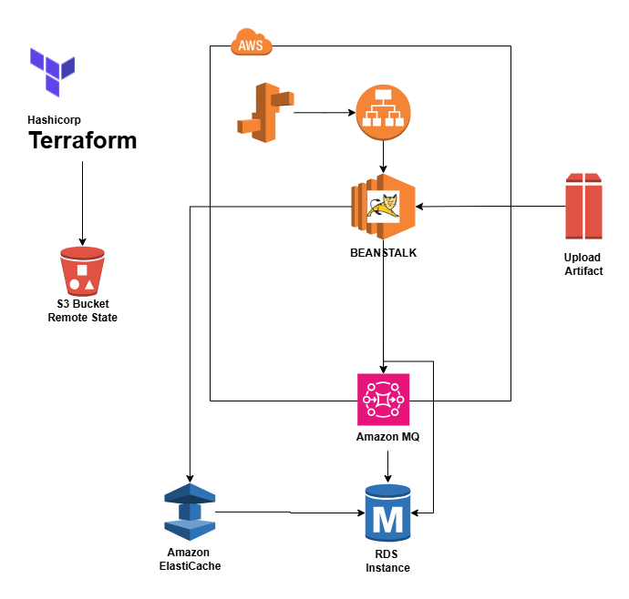

# Terraform AWS VProfile App

This repository contains Terraform code to provision the **VProfile application infrastructure** on **AWS**. The infrastructure includes networking, security, compute, and automation resources to deploy a scalable environment.

---

## 📐 Arquitectura



---

## 📁 Project Structure

```
.
├── app-project/                  # VProfile application source and notes
│   └── vprofile-project/
├── architecture/                # Network and infrastructure diagrams
│   └── terraform_aws_vprofile-app.drawio.png
├── backend-services.tf          # ECS/Beanstalk related service configs
├── backend.tf                   # Terraform backend configuration (e.g., S3)
├── bastion-host.tf              # Bastion host configuration
├── bean-app.tf                  # Elastic Beanstalk application resource
├── bean-env.tf                  # Elastic Beanstalk environment configuration
├── keypairs.tf                  # EC2 key pair definitions
├── outputs.tf                   # Terraform output values
├── providers.tf                 # Provider setup (e.g., AWS region)
├── secgrp.tf                    # Security groups
├── templates/                   # Template files for automation
│   └── db-deploy.tmpl
├── terraform.tfvars             # Variable values
├── variables.tf                 # Variable definitions
├── vpc.tf                       # VPC and subnet configurations
├── vprofilekey / .pub           # SSH key pair (⚠️ Consider removing private key from repo)
```

---

## 🧱 Infrastructure Components

- **VPC:** Custom Virtual Private Cloud with public/private subnets
- **Bastion Host:** For secure SSH access to private resources
- **Elastic Beanstalk:** Hosting the VProfile application
- **Security Groups:** Ingress/egress control across tiers
- **Key Pairs:** For secure EC2 instance access
- **Templates:** Used to automate DB deployment and app setup
- **Terraform Backend:** Remote state setup via `backend.tf` (e.g., S3)

---

## 🚀 Getting Started

### Prerequisites

- [Terraform](https://www.terraform.io/downloads.html) installed
- AWS credentials configured (via environment variables, profile, or IAM role)
- Optional: Revise or generate new SSH key pair for production use

### Steps

1. Clone the repository:

```bash
git clone https://github.com/Roberto-1998/terraform_aws_vprofile-app.git
cd terraform_aws_vprofile-app
```

2. Initialize the Terraform backend:

```bash
terraform init
```

3. Review and apply the infrastructure plan:

```bash
terraform plan
terraform apply
```

> 💡 You can customize values using `terraform.tfvars` or by passing `-var` flags.

---

## ⚠️ Security Notice

Do **not** commit private key files (`vprofilekey`) to version control. You should:

- Add `vprofilekey` to `.gitignore`
- Revoke any exposed key pairs
- Generate fresh key pairs for secure deployments

---

## 📄 License

This project is licensed under the MIT License.

---

## 🙋‍♂️ Author

**Roberto (Roberto-1998)**  
GitHub: [@Roberto-1998](https://github.com/Roberto-1998)
